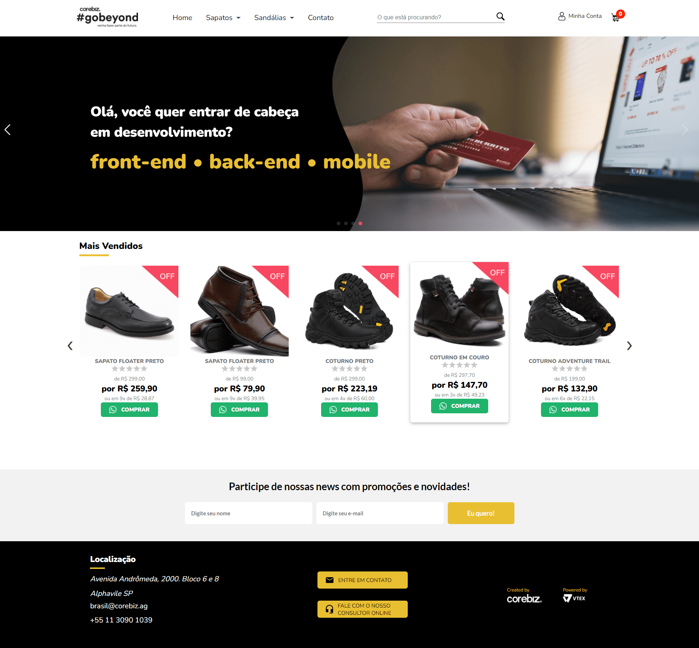
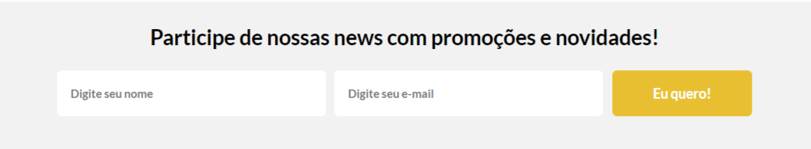
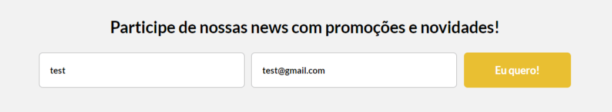
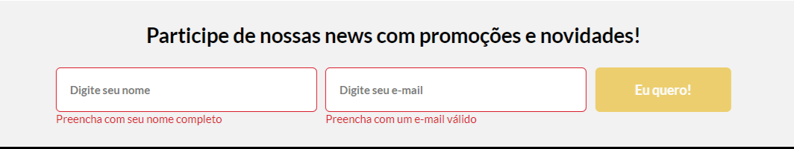
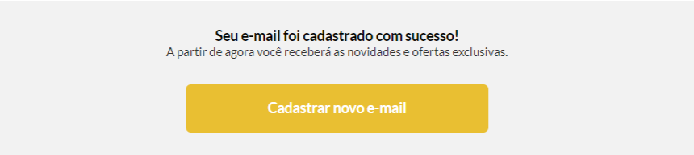
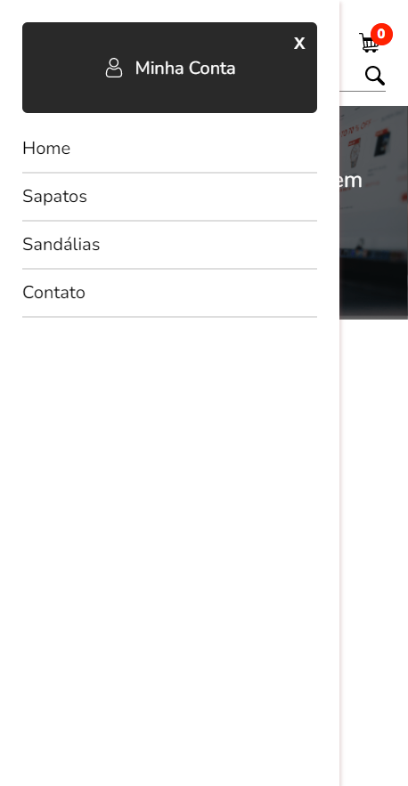

# Challenge 01 - Gobeyond Front-end - Corebiz

Foi proposto como desafio o desenvolvimento da página Home de um e-commerce com
HTML, CSS e JavaScript, também foi permitido o uso do React.

## O que eu fiz?
Como já tenho um pouco de conhecimento, decidi desenvolver com NextJS e TypeScript, o CSS foi utilizando CSS Modules.

### Executando a aplicação
Clone o repositório/projeto
```bash
$ git clone https://github.com/dan-liberato/go-beyond-front-end.git
```
Instale as dependências
```bash
$ yarn install ou npm install
```
Execute em modo de desenvolvimento
```bash
$ yarn dev ou npm run dev
```
Gerar a build
```bash
$ yarn build ou npm run build
```
Executar a build
```bash
$ yarn start ou npm run start
```

### Newsletter
<div style="display: table;max-width:840px; margin: 0 auto;"><br>





</div>

### Mobile menu
<div style="display: table;max-width:380px; margin: 0 auto;"><br>



</div>

<div style="**display**: inline_block"><br>
    
    
    
</div>
